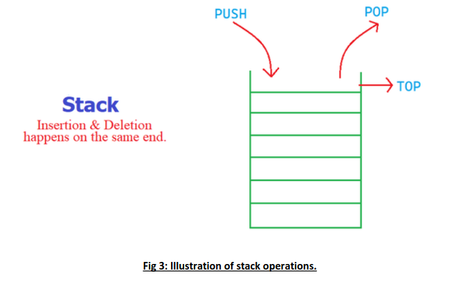
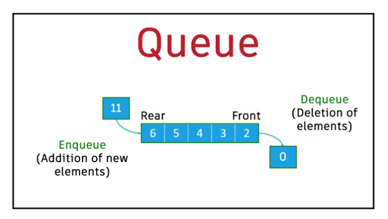

# Cheat Sheet for DSA Labs

## Some basic pre-requisite knowledge

### Import Statements
```c
#include <headers.h> // for system headers
#include "headers.h" // for user headers
```

### MakeFile Format

```make
target : prerequisite prerequisite prerequisite...
    command1
    command2
    command3...
```
> NOTE: using only `make` command will execute the first target statement.

### Creating Pointers
```c
int n = 10;

// Initialising NULL Pointers
int* intPointer = NULL; // Creates a null Pointer of datatype int
char* cp = NULL; // Creates a null Pointer of datatype char
double* dp = NULL; // Creates a null Pointer of datatype double
float* fp = NULL; // Creates a null Pointer of datatype float

// Assigning Pointer to variables
intPointer = &n; // Assigns intPointer to Variable 'n'

// Checking Memory Location Formats
printf("Address of n variable: %x\n", &n ); // Address stored of variable
printf("Address stored in ip variable: %x\n", intPointer ); // Address stored in pointer variable
printf("Value of *ip variable: %d\n", *intPointer ); // Access the value using the pointer

//Checks for Null
if(intPointer) // Gives True if not NULL
if(!intPointer) // Gives True if NULL
```

### Dynamically Allocated Arrays

#### malloc()
```c
#include <stdio.h>
#include <stdlib.h> // Required for Dynamic Memory
int main()
{
    int n = 10;
    int* p = (int *) malloc(n);
    if (p == NULL)
    {
    printf("Unable to allocate memory\n");
    return -1;
}
printf("Allocated %d bytes of memory\n", n);
return 0;
}
```

> NOTE: Always use `free(POINTER_NAME)` command to free the memory when not required.

> NOTE: Always make sure if Memory Allocation has occurred or not by `NULL` check.

#### calloc()
This function can allocate multiple contiguous memory blocks of given size and initializes each block to zero value, whereas malloc allocates a single memory block and the value at the pointed location is random or garbage. calloc allocates memory and zeroes the allocated blocks. calloc stands for "contiguous allocation".
```c
void *calloc(size_t no_of_members, size_t size);
```
no_of_members represents number of memory blocks. size represents the size of each block.This is more suitable for allocating memory for arrays. 
> NOTE:  “zero value” doesn't just mean 0. If we are allocating an array of structs, calloc() assigns NULL value to strings, 0 to ints/floats, etc.

#### realloc()
The realloc() function is used to resize the memory block pointed to a pointer that was previously allocated to the variable by the malloc() or calloc() function. realloc stands for reallocation. Its function header is the following:
```c
void *realloc(void *ptr, size_t size)
```
- ptr: It is the pointer of the memory block which was previously allocated to the calloc(), malloc(), or realloc() function that is to be reallocated. If this pointer is NULL, then a new block is allocated and the pointer to it is returned by the realloc() function.
- size: It is the new size of the memory block which is to be reallocated. It is passed in bytes. If the size is 0, then the memory block pointed by ptr is deallocated and a NULL pointer is returned by the realloc() function even if ptr points to an existing block of memory.

If the realloc() request is successful, then it will return a pointer to the block of newly allocated memory. If the request fails, it will return a NULL pointer.

#### free()
The free function deallocates dynamic memory. Calling free(p) just before return in the above snippet would have prevented the error. free MUST be called explicitly after the usage of dynamic memory, irrespective of which function is used to create it (malloc, calloc etc.). Its function header looks as follows:
```c
void free(void *ptr);
```

#### Dangling Pointer:
```c
int* p = NULL;
p = (int*) malloc(sizeof(int));
printf(“Address pointed by p = %p\n”, p);
free(p);
```

> NOTE: While we have deallocated the memory pointed to by the pointer p using the free() function, now the pointer p still points to the same memory location. Hence, p now becomes a `dangling pointer`, which means that p is not referring to a valid memory location of the program.

#### Memory Leak
```c
int* p; int* q;
p = (int*) malloc(1000*sizeof(int));
q = (int*) malloc(sizeof(int));
p = q;
```
> NOTE: p is made to point to another memory block without freeing the previous one. The memory previously allocated to p now becomes inaccessible. This is known as a `memory leak`.

#### Example for struct
```c
#include <stdio.h>
#include <stdlib.h>
#include <string.h>

typedef struct name {
    char first[20];
    char last[20];
} Name;

int main()
{
    int n;
    printf("Enter size of the array: ");
    scanf("%d", &n);

    Name* arr = calloc(n, sizeof(Name)); // Creating enough space for 'n' names.
    if (arr == NULL){
        printf("Unable to allocate memory\n");
        return -1;
    }
    printf("Enter the names (space separated): ");
    for (int i = 0; i < n; i++)
    {
        // Using . to access members of the struct
        scanf("%s %s", arr[i].first, arr[i].last);
        // Note that arr[i].first is equivalent to (arr+i)->first
        }
    printf("\nGiven array of names: ");
    for (int i = 0; i < n; i++)
        printf("%s %s\n", arr[i].first, arr[i].last);
    printf("\n");

    printf("Adding an element to the array.\n");
    Name newname;
    printf("Enter the name to be added: ");
    scanf("%s %s", newname.first, newname.last);

    arr = realloc(arr, (n + 1) * sizeof(Name));

    // Copying the new name to the end of the array
    strcpy(arr[n].first, newname.first);
    strcpy(arr[n].last, newname.last);

    printf("\nModified Array: ");
    for (int i = 0; i < n + 1; i++)
    printf("%s %s\n", arr[i].first, arr[i].last);
    printf("\n");

    free(arr);
}
```

### Ways to Access memory of Arrays

```c
for(int i = 0; i < 10; i++)
    printf("%f ", *(p + i));


for(int i = 0; i < 10; i++)
    printf("%f ", p[i]);

// Both Give the Same Result
```

### File I/O Handling

> NOTE: Library `stdio.h` contains functions for `FILE` handling.

> NOTE: C libraries support procedures `fscanf()`, `fgets()`, `fprintf()`, and `fputs()` for reading and writing to a file. Refer to the manual pages for information on how to use these procedures. They are similar to scanf and printf but take an additional (first) argument which is the file pointer.

#### fopen()
```c
FILE* fp;
fp = fopen(“filename”, “mode”);
```
- fp: file pointer to the data type “FILE”.
- filename: the actual file name including the path of the file.
- mode: refers to the operation that will be performed on the file. This shall be elaborated below.

#### fclose()
```c
fclose(fp);
```

#### fgets()
fgets(): To read from a file.
Declaration: 
```c
char *fgets(char *string, int n, FILE *fp)
```

Description: fgets() function is used to read a file line by line as shown below.
```c
fgets (buffer, size, fp);
```
- buffer: the buffer where the data is to be put.
- size: size of the buffer.
- fp: file pointer.

#### fprintf()
Declaration:
```c
int fprintf(FILE *fp, const char *format, ...)
```

Description: fprintf() function writes a string into a file pointed by fp as shown below.
```c
fprintf (fp, “some_data”); // To use fixed entries
//or
fprintf (fp, “text %d”, variable_name); // To use variables inside text
```

#### fscanf()
Declaration: 
```c
int fscanf(FILE *fp, const char *format, ...)
```
Description: fscanf() function reads formatted input from the file as shown below.
```c
fscanf(fp, "%s %s %s %d", str1, str2, str3, &year);
```

#### modes
| Mode    | Description                                                                                                                                                                                                                                                       |
| ------- | ----------------------------------------------------------------------------------------------------------------------------------------------------------------------------------------------------------------------------------------------------------------- |
| **r**   | Searches file.<br>  If the file is opened successfully:<br>    `fopen()` loads it into memory<br>    and sets a pointer to the first character.<br>  Else:<br>    `fopen()` returns `NULL`. |
| **rb**  | Open for reading in binary mode.<br>  If the file exists:<br>    file is opened successfully.<br>  Else:<br>    `fopen()` returns `NULL`. |
| **w**   | Searches file.<br>  If the file exists:<br>    its contents are overwritten.<br>  Else:<br>    a new file is created.<br>  If unable to open:<br>    returns `NULL`.  |
| **wb**  | Open for writing in binary mode.<br>  If the file exists:<br>    its contents are overwritten.<br>  Else:<br>    a new file is created. |
| **a**   | Searches file.<br>  If the file is opened successfully:<br>    `fopen()` loads it into memory<br>    and sets a pointer to the last character.<br>  Else if the file does not exist:<br>    a new file is created.<br>  If unable to open:<br>    returns `NULL`. |
| **ab**  | Open for appending in binary mode.<br>  Data is added to the end of the file.<br>  If the file does not exist:<br>    a new file is created. |
| **r+**  | Searches file.<br>  If the file is opened successfully:<br>    `fopen()` loads it into memory<br>    and sets a pointer to the first character.<br>  Else:<br>    returns `NULL`. |
| **rb+** | Open for both reading and writing in binary mode.<br>  If the file exists:<br>    file is opened successfully.<br>  Else:<br>    `fopen()` returns `NULL`.|
| **w+**  | Searches file.<br>  If the file exists:<br>    its contents are overwritten.<br>  Else:<br>    a new file is created.<br>  If unable to open:<br>    returns `NULL`. |
| **wb+** | Open for both reading and writing in binary mode.<br>  If the file exists:<br>    its contents are overwritten.<br>  Else:<br>    a new file is created. |
| **a+**  | Searches file.<br>  If the file is opened successfully:<br>    `fopen()` loads it into memory<br>    and sets a pointer to the last character.<br>  Else if the file does not exist:<br>    a new file is created.<br>  If unable to open:<br>    returns `NULL`. |
| **ab+** | Open for both reading and appending in binary mode.<br>  If the file does not exist:<br>    a new file is created. |

### Linked Lists

- They are `dynamic arrays` alternative. 
- They are sequential access lists.
- They are `not` stored in `contiguous location` in the memory.The elements are linked using pointers.
- Have a series of connected Nodes.

#### Types of Linked Lists

1. Singly Linked List
- Each `node` contains a single `pointer`, and that pointer points to next node.
- Traversal of list in 1 direction only. 

2. Doubly Linkd List
- Each `node` contains two `pointers`, one that points to next node and the other to the previous one.
- Traversal of list in 2 ways.
- 2 pointers point towards `NULL`.

3. Circular Linked List
- Singly Linked List with last node's pointer to the first node in the list.
- Traversal is infinite, it never ends.

### Efficiency estimation

#### Measuring Execution Time

We use `gettimeofday()` from the `sys/time.h` library. 

## Heap Space Measurement (Efficiency Estimation)

The space-time tradeoff is a common theme while dealing with performance optimisation. Oftentimes, improving the performance of one comes at the cost of the other. 

We would be using a simple technique where we would add a wrapper around our memory management functions (malloc() and free()).

### Wrappers

")

Whenever this new version malloc() (say myalloc()) is called requesting a certain number of bytes (say n) of memory, myalloc() would now internally request (sizeof(int) + n) bytes of memory (using malloc()). 

")

Subsequently, myalloc() would store the integer n at the beginning of the block and return the pointer starting from just after the integer holding the size. It would also update a global variable holding the total size allocated.

In this way, the calling function sees no change in the returned pointer, but in memory the size information has been stored. So now when this pointer would be passed to wrapper version of free() (say myfree()), it would look for an integer stored just before the start of the block pointed to by the pointer (by decrementing the void pointer by sizeof(int) (ie 4 bytes) and dereferencing it as an int called size), decrement this integer size from the global variable maintaining the total allocated size, and then free the entire block including the integer.

Sample Demonstartion is at [Sample Wrapper Code](Lab%203/SelfCodes/wrappers_memory.c).

### Void Pointers

Syntax for `malloc()`
```c
void *malloc(size_t size);
```

A `void pointer` is a pointer that has no associated data type. A void pointer can hold the address of any data type and can be typecasted to any other pointer type. However, since a void pointer does not know the size or type of the data it points to, **it cannot be dereferenced directly**. Therefore, a void pointer must be **explicitly cast to a specific pointer type** before dereferencing.

For example, if an integer value is stored at the memory location pointed to by a void pointer ptr, it can be accessed as follows:
```c
*((int *)(ptr)) = 42;

// Or

int x = *((int *)(ptr));
```

#### Advantages

- Primarily used to achieve **type-independent memory management**.
- Used in **dynamic memory allocation function** such as malloc().
- Used in **generic programming** and **generic data structures**(linkd list, stacks, queues).

## Abstract Data Types (ADTs)

- Theoretical specification of a data structure and its operations.
- An ADT is defined by just its operations.
- We will use header files to implement the ADTs in C.

### Formal Defination

An ADT is a mathematically specified entity that defines a set of its instances, with:
1. A specific interface: This is a collection of signatures (or function declarations in C) of operations that can be invoked on an instance. This might be provided as an interface in Java or a header file in C.
2. A set of axioms (pre-conditions and post-conditions) that define the semantics of the operations (i.e., what the operations do to instances of the ADT, but not how). These pre- and post-conditions would be typically expressed in some form of predicate logic expressions (don’t worry if you haven’t studied them).

### Stack ADT

- **Last in First Out (LIFO)** structure.
- Insert & remove elements from the same end - **top** of a stack.

- Inserting a new element is called **pushing** the element to the stack.
- Removing an element is called **popping** the element of the stack.



#### Common Application

- When we want to provide the user the ability to undo the previous action.

#### Behaviour (Interface)

The following methods are implemented in the `Stack ADT`:
- `Element top(Stack s)`: Get the last element
- `Stack pop(Stack s)`: Remove the last element
- `Stack push(Stack s, Element e)`: Add a new element
- `Boolean isEmpty(Stack s)`: Find whether the list is empty
- `Stack newStack()`: Creates a new Stack

#### properties (Axioms) (for unbound Stack)

The following axioms must hold for the implementation to ensure correctness:
- `isEmpty(newStack()) == TRUE`
- `isEmpty(push(s,e)) == FALSE`
- `top(push(s,e)) == e`
- `pop(push(s,e)) == s`

#### Some Important Things to keep in mind

##### Include Guard

> We use an `include-guard` to prevent multiple inclusion from happening, thus avoiding compilation error. It is a standard good practice to follow.

Syntax:
```h
#ifndef <token>
#define <token>
// header file contents..
#endif
```

More Info at [Wiki-Link](https://en.wikipedia.org/wiki/Include_guard).

##### Boolean Implementation

```c
#include <stdbool.h>
//...
bool isEmpty = true;
```

Or we can create the following header file as it is for direct implementation in our project.

```h
#ifndef BOOL_H
#define BOOL_H

typedef enum { false, true } bool;

#endif
```

#### Implementation

Can be done via [Linked Lists](#linked-lists) or [Arrays](#dynamically-allocated-arrays)

> NOTE : PENDING NOTES?

### Queue ADT

- **First in First Out Principle (FIFO)**
- Insertion & Deletion occurs at **different** ends
- Insertion of new element is caleed **enqueue** operation which takes place at the rear of the queue.
- Deletion of element is called **dequeue** operation which takes place at the front of the queue.



#### Behaviour (Interface)

The following methods are included in the Queue ADT:
- Queue createQueue(): Create an empty queue
- Queue enqueue(Queue q, Element o): Insert object o at the rear of the queue
- Queue dequeue(Queue q): Remove the object from the front end of the queue; throw an error if queue is empty
- Element front(Queue q): Return (and not remove) the element at the front end of the queue; throw an error if queue is empty
- int size(Queue q): Return the number of elements in the queue
- boolean empty(Queue q): Return TRUE if the queue is empty, FALSE otherwise

#### Properties (Axioms)

The following axioms must hold for the implementation to ensure correctness:
- Front(Enqueue(createQueue(), v)) == v
- Dequeue(Enqueue(createQueue(), v)) == createQueue()
- Front(Enqueue(Enqueue(Q, w), v)) == Front(Enqueue(Q, w))
- Dequeue(Enqueue(Enqueue(Q, w), v)) == Enqueue(Dequeue(Enqueue(Q, w)), v)

#### Implementation


