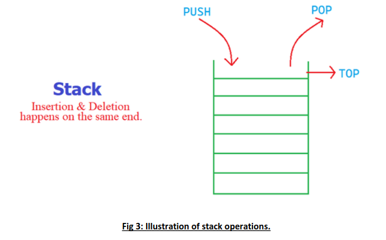
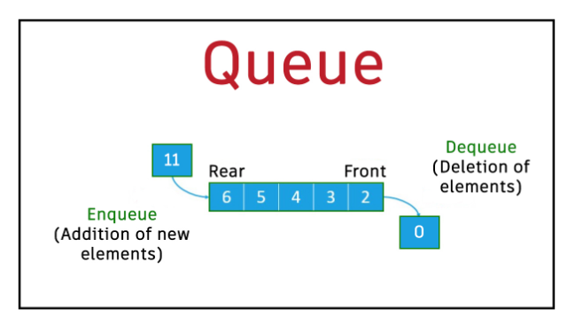
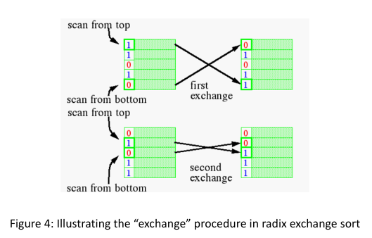
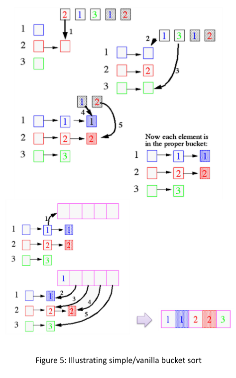
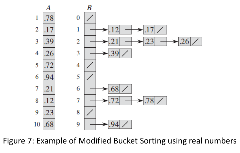

# Cheat Sheet for DSA Labs

## Some basic pre-requisite knowledge

### Import Statements
```c
#include <headers.h> // for system headers
#include "headers.h" // for user headers
```

### MakeFile Format

```make
target : prerequisite prerequisite prerequisite...
    command1
    command2
    command3...
```
> NOTE: using only `make` command will execute the first target statement.

### Creating Pointers
```c
int n = 10;

// Initialising NULL Pointers
int* intPointer = NULL; // Creates a null Pointer of datatype int
char* cp = NULL; // Creates a null Pointer of datatype char
double* dp = NULL; // Creates a null Pointer of datatype double
float* fp = NULL; // Creates a null Pointer of datatype float

// Assigning Pointer to variables
intPointer = &n; // Assigns intPointer to Variable 'n'

// Checking Memory Location Formats
printf("Address of n variable: %x\n", &n ); // Address stored of variable
printf("Address stored in ip variable: %x\n", intPointer ); // Address stored in pointer variable
printf("Value of *ip variable: %d\n", *intPointer ); // Access the value using the pointer

//Checks for Null
if(intPointer) // Gives True if not NULL
if(!intPointer) // Gives True if NULL
```

### Dynamically Allocated Arrays

#### malloc()
```c
#include <stdio.h>
#include <stdlib.h> // Required for Dynamic Memory
int main()
{
    int n = 10;
    int* p = (int *) malloc(n);
    if (p == NULL)
    {
    printf("Unable to allocate memory\n");
    return -1;
}
printf("Allocated %d bytes of memory\n", n);
return 0;
}
```

> NOTE: Always use `free(POINTER_NAME)` command to free the memory when not required.

> NOTE: Always make sure if Memory Allocation has occurred or not by `NULL` check.

#### calloc()
This function can allocate multiple contiguous memory blocks of given size and initializes each block to zero value, whereas malloc allocates a single memory block and the value at the pointed location is random or garbage. calloc allocates memory and zeroes the allocated blocks. calloc stands for "contiguous allocation".
```c
void *calloc(size_t no_of_members, size_t size);
```
no_of_members represents number of memory blocks. size represents the size of each block.This is more suitable for allocating memory for arrays. 
> NOTE:  “zero value” doesn't just mean 0. If we are allocating an array of structs, calloc() assigns NULL value to strings, 0 to ints/floats, etc.

#### realloc()
The realloc() function is used to resize the memory block pointed to a pointer that was previously allocated to the variable by the malloc() or calloc() function. realloc stands for reallocation. Its function header is the following:
```c
void *realloc(void *ptr, size_t size)
```
- ptr: It is the pointer of the memory block which was previously allocated to the calloc(), malloc(), or realloc() function that is to be reallocated. If this pointer is NULL, then a new block is allocated and the pointer to it is returned by the realloc() function.
- size: It is the new size of the memory block which is to be reallocated. It is passed in bytes. If the size is 0, then the memory block pointed by ptr is deallocated and a NULL pointer is returned by the realloc() function even if ptr points to an existing block of memory.

If the realloc() request is successful, then it will return a pointer to the block of newly allocated memory. If the request fails, it will return a NULL pointer.

#### free()
The free function deallocates dynamic memory. Calling free(p) just before return in the above snippet would have prevented the error. free MUST be called explicitly after the usage of dynamic memory, irrespective of which function is used to create it (malloc, calloc etc.). Its function header looks as follows:
```c
void free(void *ptr);
```

#### Dangling Pointer:
```c
int* p = NULL;
p = (int*) malloc(sizeof(int));
printf(“Address pointed by p = %p\n”, p);
free(p);
```

> NOTE: While we have deallocated the memory pointed to by the pointer p using the free() function, now the pointer p still points to the same memory location. Hence, p now becomes a `dangling pointer`, which means that p is not referring to a valid memory location of the program.

#### Memory Leak
```c
int* p; int* q;
p = (int*) malloc(1000*sizeof(int));
q = (int*) malloc(sizeof(int));
p = q;
```
> NOTE: p is made to point to another memory block without freeing the previous one. The memory previously allocated to p now becomes inaccessible. This is known as a `memory leak`.

#### Example for struct
```c
#include <stdio.h>
#include <stdlib.h>
#include <string.h>

typedef struct name {
    char first[20];
    char last[20];
} Name;

int main()
{
    int n;
    printf("Enter size of the array: ");
    scanf("%d", &n);

    Name* arr = calloc(n, sizeof(Name)); // Creating enough space for 'n' names.
    if (arr == NULL){
        printf("Unable to allocate memory\n");
        return -1;
    }
    printf("Enter the names (space separated): ");
    for (int i = 0; i < n; i++)
    {
        // Using . to access members of the struct
        scanf("%s %s", arr[i].first, arr[i].last);
        // Note that arr[i].first is equivalent to (arr+i)->first
        }
    printf("\nGiven array of names: ");
    for (int i = 0; i < n; i++)
        printf("%s %s\n", arr[i].first, arr[i].last);
    printf("\n");

    printf("Adding an element to the array.\n");
    Name newname;
    printf("Enter the name to be added: ");
    scanf("%s %s", newname.first, newname.last);

    arr = realloc(arr, (n + 1) * sizeof(Name));

    // Copying the new name to the end of the array
    strcpy(arr[n].first, newname.first);
    strcpy(arr[n].last, newname.last);

    printf("\nModified Array: ");
    for (int i = 0; i < n + 1; i++)
    printf("%s %s\n", arr[i].first, arr[i].last);
    printf("\n");

    free(arr);
}
```

### Ways to Access memory of Arrays

```c
for(int i = 0; i < 10; i++)
    printf("%f ", *(p + i));


for(int i = 0; i < 10; i++)
    printf("%f ", p[i]);

// Both Give the Same Result
```

### File I/O Handling

> NOTE: Library `stdio.h` contains functions for `FILE` handling.

> NOTE: C libraries support procedures `fscanf()`, `fgets()`, `fprintf()`, and `fputs()` for reading and writing to a file. Refer to the manual pages for information on how to use these procedures. They are similar to scanf and printf but take an additional (first) argument which is the file pointer.

#### fopen()
```c
FILE* fp;
fp = fopen(“filename”, “mode”);
```
- fp: file pointer to the data type “FILE”.
- filename: the actual file name including the path of the file.
- mode: refers to the operation that will be performed on the file. This shall be elaborated below.

#### fclose()
```c
fclose(fp);
```

#### fgets()
fgets(): To read from a file.
Declaration: 
```c
char *fgets(char *string, int n, FILE *fp)
```

Description: fgets() function is used to read a file line by line as shown below.
```c
fgets (buffer, size, fp);
```
- buffer: the buffer where the data is to be put.
- size: size of the buffer.
- fp: file pointer.

#### fprintf()
Declaration:
```c
int fprintf(FILE *fp, const char *format, ...)
```

Description: fprintf() function writes a string into a file pointed by fp as shown below.
```c
fprintf (fp, “some_data”); // To use fixed entries
//or
fprintf (fp, “text %d”, variable_name); // To use variables inside text
```

#### fscanf()
Declaration: 
```c
int fscanf(FILE *fp, const char *format, ...)
```
Description: fscanf() function reads formatted input from the file as shown below.
```c
fscanf(fp, "%s %s %s %d", str1, str2, str3, &year);
```

#### modes
| Mode    | Description                                                                                                                                                                                                                                                       |
| ------- | ----------------------------------------------------------------------------------------------------------------------------------------------------------------------------------------------------------------------------------------------------------------- |
| **r**   | Searches file.<br>  If the file is opened successfully:<br>    `fopen()` loads it into memory<br>    and sets a pointer to the first character.<br>  Else:<br>    `fopen()` returns `NULL`. |
| **rb**  | Open for reading in binary mode.<br>  If the file exists:<br>    file is opened successfully.<br>  Else:<br>    `fopen()` returns `NULL`. |
| **w**   | Searches file.<br>  If the file exists:<br>    its contents are overwritten.<br>  Else:<br>    a new file is created.<br>  If unable to open:<br>    returns `NULL`.  |
| **wb**  | Open for writing in binary mode.<br>  If the file exists:<br>    its contents are overwritten.<br>  Else:<br>    a new file is created. |
| **a**   | Searches file.<br>  If the file is opened successfully:<br>    `fopen()` loads it into memory<br>    and sets a pointer to the last character.<br>  Else if the file does not exist:<br>    a new file is created.<br>  If unable to open:<br>    returns `NULL`. |
| **ab**  | Open for appending in binary mode.<br>  Data is added to the end of the file.<br>  If the file does not exist:<br>    a new file is created. |
| **r+**  | Searches file.<br>  If the file is opened successfully:<br>    `fopen()` loads it into memory<br>    and sets a pointer to the first character.<br>  Else:<br>    returns `NULL`. |
| **rb+** | Open for both reading and writing in binary mode.<br>  If the file exists:<br>    file is opened successfully.<br>  Else:<br>    `fopen()` returns `NULL`.|
| **w+**  | Searches file.<br>  If the file exists:<br>    its contents are overwritten.<br>  Else:<br>    a new file is created.<br>  If unable to open:<br>    returns `NULL`. |
| **wb+** | Open for both reading and writing in binary mode.<br>  If the file exists:<br>    its contents are overwritten.<br>  Else:<br>    a new file is created. |
| **a+**  | Searches file.<br>  If the file is opened successfully:<br>    `fopen()` loads it into memory<br>    and sets a pointer to the last character.<br>  Else if the file does not exist:<br>    a new file is created.<br>  If unable to open:<br>    returns `NULL`. |
| **ab+** | Open for both reading and appending in binary mode.<br>  If the file does not exist:<br>    a new file is created. |

### Linked Lists

- They are `dynamic arrays` alternative. 
- They are sequential access lists.
- They are `not` stored in `contiguous location` in the memory.The elements are linked using pointers.
- Have a series of connected Nodes.

#### Types of Linked Lists

1. Singly Linked List
- Each `node` contains a single `pointer`, and that pointer points to next node.
- Traversal of list in 1 direction only. 

2. Doubly Linkd List
- Each `node` contains two `pointers`, one that points to next node and the other to the previous one.
- Traversal of list in 2 ways.
- 2 pointers point towards `NULL`.

3. Circular Linked List
- Singly Linked List with last node's pointer to the first node in the list.
- Traversal is infinite, it never ends.

### Efficiency estimation

#### Measuring Execution Time

We use `gettimeofday()` from the `sys/time.h` library. 

## Heap Space Measurement (Efficiency Estimation)

The space-time tradeoff is a common theme while dealing with performance optimisation. Oftentimes, improving the performance of one comes at the cost of the other. 

We would be using a simple technique where we would add a wrapper around our memory management functions (malloc() and free()).

### Wrappers

")

Whenever this new version malloc() (say myalloc()) is called requesting a certain number of bytes (say n) of memory, myalloc() would now internally request (sizeof(int) + n) bytes of memory (using malloc()). 

")

Subsequently, myalloc() would store the integer n at the beginning of the block and return the pointer starting from just after the integer holding the size. It would also update a global variable holding the total size allocated.

In this way, the calling function sees no change in the returned pointer, but in memory the size information has been stored. So now when this pointer would be passed to wrapper version of free() (say myfree()), it would look for an integer stored just before the start of the block pointed to by the pointer (by decrementing the void pointer by sizeof(int) (ie 4 bytes) and dereferencing it as an int called size), decrement this integer size from the global variable maintaining the total allocated size, and then free the entire block including the integer.

Sample Demonstartion is at [Sample Wrapper Code](Lab%203/SelfCodes/wrappers_memory.c).

### Void Pointers

Syntax for `malloc()`
```c
void *malloc(size_t size);
```

A `void pointer` is a pointer that has no associated data type. A void pointer can hold the address of any data type and can be typecasted to any other pointer type. However, since a void pointer does not know the size or type of the data it points to, **it cannot be dereferenced directly**. Therefore, a void pointer must be **explicitly cast to a specific pointer type** before dereferencing.

For example, if an integer value is stored at the memory location pointed to by a void pointer ptr, it can be accessed as follows:
```c
*((int *)(ptr)) = 42;

// Or

int x = *((int *)(ptr));
```

#### Advantages

- Primarily used to achieve **type-independent memory management**.
- Used in **dynamic memory allocation function** such as malloc().
- Used in **generic programming** and **generic data structures**(linkd list, stacks, queues).

## Abstract Data Types (ADTs)

- Theoretical specification of a data structure and its operations.
- An ADT is defined by just its operations.
- We will use header files to implement the ADTs in C.

### Formal Defination

An ADT is a mathematically specified entity that defines a set of its instances, with:
1. A specific interface: This is a collection of signatures (or function declarations in C) of operations that can be invoked on an instance. This might be provided as an interface in Java or a header file in C.
2. A set of axioms (pre-conditions and post-conditions) that define the semantics of the operations (i.e., what the operations do to instances of the ADT, but not how). These pre- and post-conditions would be typically expressed in some form of predicate logic expressions (don’t worry if you haven’t studied them).

### Stack ADT

- **Last in First Out (LIFO)** structure.
- Insert & remove elements from the same end - **top** of a stack.

- Inserting a new element is called **pushing** the element to the stack.
- Removing an element is called **popping** the element of the stack.



#### Common Application

- When we want to provide the user the ability to undo the previous action.

#### Behaviour (Interface)

The following methods are implemented in the `Stack ADT`:
- `Element top(Stack s)`: Get the last element
- `Stack pop(Stack s)`: Remove the last element
- `Stack push(Stack s, Element e)`: Add a new element
- `Boolean isEmpty(Stack s)`: Find whether the list is empty
- `Stack newStack()`: Creates a new Stack

#### properties (Axioms) (for unbound Stack)

The following axioms must hold for the implementation to ensure correctness:
- `isEmpty(newStack()) == TRUE`
- `isEmpty(push(s,e)) == FALSE`
- `top(push(s,e)) == e`
- `pop(push(s,e)) == s`

#### Some Important Things to keep in mind

##### Include Guard

> We use an `include-guard` to prevent multiple inclusion from happening, thus avoiding compilation error. It is a standard good practice to follow.

Syntax:
```h
#ifndef <token>
#define <token>
// header file contents..
#endif
```

More Info at [Wiki-Link](https://en.wikipedia.org/wiki/Include_guard).

##### Boolean Implementation

```c
#include <stdbool.h>
//...
bool isEmpty = true;
```

Or we can create the following header file as it is for direct implementation in our project.

```h
#ifndef BOOL_H
#define BOOL_H

typedef enum { false, true } bool;

#endif
```

#### Implementation

Can be done via [Linked Lists](#linked-lists) or [Arrays](#dynamically-allocated-arrays)

> NOTE : PENDING NOTES?

### Queue ADT

- **First in First Out Principle (FIFO)**
- Insertion & Deletion occurs at **different** ends
- Insertion of new element is caleed **enqueue** operation which takes place at the rear of the queue.
- Deletion of element is called **dequeue** operation which takes place at the front of the queue.



#### Behaviour (Interface)

The following methods are included in the Queue ADT:
- Queue createQueue(): Create an empty queue
- Queue enqueue(Queue q, Element o): Insert object o at the rear of the queue
- Queue dequeue(Queue q): Remove the object from the front end of the queue; throw an error if queue is empty
- Element front(Queue q): Return (and not remove) the element at the front end of the queue; throw an error if queue is empty
- int size(Queue q): Return the number of elements in the queue
- boolean empty(Queue q): Return TRUE if the queue is empty, FALSE otherwise

#### Properties (Axioms)

The following axioms must hold for the implementation to ensure correctness:
- Front(Enqueue(createQueue(), v)) == v
- Dequeue(Enqueue(createQueue(), v)) == createQueue()
- Front(Enqueue(Enqueue(Q, w), v)) == Front(Enqueue(Q, w))
- Dequeue(Enqueue(Enqueue(Q, w), v)) == Enqueue(Dequeue(Enqueue(Q, w)), v)

#### Implementation

----------

### Trade Off Between Space & Time

- Asymptotic Lower bound for any `strictly comparison based sorting` is $\Omega(NlogN)$
- What if we use `non-comparison methods`?
    - We might be able to bypass the $\Omega(NlogN)$ criteria if we are able to use more space in a meaningful way.


## Sorting Algorithms

### Insertion Sort

#### Insert In Order

```c
void insertionSort(int A[], int n)
{
    for(int j = 1; j < n; j++)
    {
        insertInOrder(A[j], A, j);
    }
}

// Pre-condition: (length(A) - 1 > last) & forall j: 0 <= j < last - 1: A[j] <= A[j+1]
void insertInOrder(int v, int A[], int last)
{
    int j = last - 1;
    while(j >= 0 && v < A[j])
    {
        A[j+1] = A[j];
        j--;
    }
    A[j+1] = v;
}
// Post-condition: forall j: 0 <= j <= last - 1: A[j] <= A[j+1]
```

Time Complexity: $\theta(n^{2})$


### Merge Sort

----

### Quick Sort

#### Time & Space Complexity

Worst Case : T(n) = O(n^2)
Average Case : T(n) = O(n log n)
S(n) = O(log n)

#### Strategy

1. Divide
    - Partition into 2 sub-arrays
    - Compute the index of `pivot`
2. Conquer
    - Sort the 2 sub-arrays by recursive calls to QuickSort
3. Combine
    - This Algorithm does not need this step.

#### Partitioning

- Left part should have elements less than the pivot element
- Right part should have elements moer than the pivot element.

1. Hoare Partitioning
    - While scanning elements from left to right, if we find an element that belongs to right part, their should also exist an element that belongs to left part.
    - Code:
    ```C
    // Ls[lo..hi] is the input array; Ls[pInd] is the pivot
    int part(int Ls[], int lo, int hi, int pInd){
        swap(Ls, pInd, lo);
        int pivPos, lt, rt, pv;
        lt = lo + 1;
        rt = hi;
        pv = Ls[lo];
        while (lt < rt){
            for (; lt <= hi && Ls[lt] <= pv; lt++);
            // Ls[j]<=pv for j in lo..lt-1
            for (; Ls[rt] > pv; rt--);
            // Ls[j]>pv for j in rt+1..hi
            if (lt < rt){
                swap(Ls, lt, rt);
                lt++;
                rt--;
            }
        }
        if (Ls[lt] < pv && lt <= hi)
            pivPos = lt;
        else
            pivPos = lt - 1;
        swap(Ls, lo, pivPos);
        // Postcond.: (Ls[j]<=pv for j in lo..pivPos-1) and (Ls[j]>pv for j in pivPos+1..hi)
        return pivPos;
    }
    ```
    - The above function partition the array into halves and returns the index of the pivot in the partitioned Array.

2. Lomuto Partitioning
    - A single pointer is used to iterate over the array from left to right. 
    - Initially, the pivot is swapped with the element at the last location. 
    - As the pointer moves from left to right, it keeps track of the correct position of the pivot based on the elements swept past till now and swaps any element that is less than or equal to the pivot to the left of the pivot position. 
    - Once the pointer reaches the end of the array, the pivot is swapped with the element at the pivot position, effectively partitioning the array into two parts.
    - Lomuto’s partitioning scheme uses two additional variables i and j and maintains the invariant (conditions).
    - The variable j is incremented from 1 to n−1 using a for-loop.
    - When A[j] is inspected, it is compared to the pivot p. 
    - If it is smaller than the pivot, A[i] and A[j] are swapped, and i is incremented. 
    - A[0 … i − 1] consists of elements smaller than p, A[i … j − 1] consists of elements at least as large as p; A[j … n − 2] has not been looked at and A[n-1] has the pivot.
    - Code:
    ```C
    int lomuto_partition(struct person* arr, int low, int high) {
        int pivot_height = arr[high].height;
        int i = low - 1;
        
        for (int j = low; j < high; j++) {
            if (arr[j].height <= pivot_height) {
                i++;
                // Swap arr[i] and arr[j]
                struct person temp = arr[i];
                arr[i] = arr[j];
                arr[j] = temp;
            }
        }
        // Swap arr[i+1] and arr[high]
        struct person temp = arr[i + 1];
        arr[i + 1] = arr[high];
        arr[high] = temp;
        return i + 1;
    }
    ```

3. Three-Way Partitioning
    - Three-way partitioning is one where we create three partitions — less than the pivot, equal to the pivot and greater than the pivot.
    - Code :
    ```C
    int threePart(int Ls[], int lo, int hi, int pInd){
        swap(Ls, pInd, hi - 1);
        int pivPos, lt, rt, mid, pv;
        lt = lo;
        rt = hi - 2;
        mid = lo;
        pv = Ls[hi - 1];
        while (mid <= rt){
            if (Ls[mid] < pv){
                swap(Ls, lt, mid);
                lt++;
                mid++;
            }
            else if (Ls[mid] > pv){
                swap(Ls, mid, rt);
                rt--;
            }
            else{
                mid++;
            }
        }
        swap(Ls, mid, hi - 1);
        return mid;
    }
    ```

#### Pivot Selection
- In the extreme case of unbalanced partitions (1 : n-1), we end up with a complexity of O(n2) for quicksort.

1. Selecting first/last element
    - Will work for a randomised array.
    - Will `not` work for nearly sorted array. It will lead to O(n^2).

2. Median-of-Three
    - We take the median of first, last and middle element as pivot.
    - It gives us O(n log n).
    - Good method to be used.
    

3. Median-of-Medians
    - ‘Median-of-medians’ is one technique which can be used to find the kth smallest element in an array. 
    - In the median of medians algorithm, we divide the input arrays first into groups of 5.
    - Since 5 is a small constant number, for a given list of 5 integers, we can find the median of the list in O(1) time. 
    - Now, we need to find the median of these n/5 medians which you can do by recursing into the list of n/5 elements.
    - `O(n)` can be proved
    - Code:
    ```C
    // L[] is the input array of length n
    // kth smallest element is returned
    int select(int L[], int n, int k){
        if (k == 0)
            return L[0];
        if (n <= 5){
            for (int i = 1; i < n; i++)
                for (int j = i-1; j >= 0; j--)
                    if (L[j] > L[j+1])
                        swap(L, j, j+1);
                    else
                        break;
            return L[k-1];
        }
        // partition L into subsets of five elements each (there will be n/5 subsets total).
        int numGroups;
        if (n % 5 == 0)
            numGroups = n/5;
        else
            numGroups = n/5 + 1;
        int medians[numGroups];
        for (int i = 0; i < numGroups; i++){
            medians[i] = select(L + i*5, min(5, n - i*5), min(5, n - i*5)/2);
        }
        int M = select(medians, numGroups, (numGroups+1)/2)
        // Partition array into two halves, L1, {M} and L2, such that
        // L1 contains elements <= M, {M} contains one instance of M and L2 contains all elements > M
        int mInd;
        for (int i = 0; i < n; i++){
            if (L[i] == M){
                mInd = i;
                break;
            }
        }
        int pInd = part(L, 0, n-1, mInd);
        if (k <= pInd)
            return select(L, pInd, k);
        else if (k > pInd + 1)
            return select(L + pInd + 1, n - pInd - 1, k - pInd - 1);
        else
            return L[pInd];
    }
    ```

4. Quickselect
    - Used to find the kth smallest element in an array.
    - We recurse only in the range that may contain the required index.
    - We get `O(n)` instead of `O(n log n)`
    - Code:
    ```C
    // L[] is the input array of length n
    // kth smallest element is returned
    int qselect(int L[], int n, int k)
    {
        int pivot = 0;
        int lo = 0;
        int hi = n - 1;
        int pInd = part(L, lo, hi, pivot);
        if (k <= pInd)
            return qselect(L, pInd, k);
        else if (k > pInd + 1)
            return qselect(L + pInd + 1, n - pInd - 1, k - pInd - 1);
        else
            return L[pInd];
    }
    ```

5. Random Pivot
    - We can take user Input between 2 numbers
        - Code:
        ```C
            #include <stdio.h>
            #include <stdlib.h>
            #include <time.h>

            int main(){
                int a, b;
                printf("Enter a and b: ");
                scanf("%d %d", &a, &b);
                srand(time(NULL));
                int r = rand() % (b - a + 1) + a;
                printf("Random number between %d and %d is %d\n", a, b, r);
                return 0;
            }
        ```

    - We can take current time and use it as a seed for random number generation.
        - Code:
        ```C
        #include <stdio.h>
        #include <stdlib.h>
        #include <sys/time.h>

        int randomPivot(int lo, int hi){
            struct timeval tv;
            gettimeofday(&tv, NULL);
            srand(tv.tv_usec * 1000000 + tv.tv_sec);
            return (rand() % (hi - lo)) + lo;
        }

        int main(){
            int low = 0;
            int high = 1000;
            int randgen = randomPivot(low, high);
            printf("Random number between %d and %d is %d\n", low, high, randgen);
            return 0;
        }
        ```

#### Putting all together

    - We can take any combination of pivot selection snd partitioning techniques and get a inplemented version of quicksort.
    - Genral Format : 
```C
    void qs(int Ls[], int lo, int hi){
        if (lo < hi){
            int p = pivot(Ls, lo, hi);
            // Ls[p] is the pivot
            p = part(Ls, lo, hi, p); // Ls[p] is the pivot
            /*
                (Ls[j]<=Ls[p] for j in lo..pPos-1) and
                (Ls[j]>Ls[p] for j in pPos+1..hi)
            */
            qs(Ls, lo, p - 1);
            qs(Ls, p + 1, hi);
        }
    }
```

### Hybrid Quick Sort
For array size less than a fixed size, we prefer using Insertion Sort, for the rest of the code we use QuickSort.

```C
    void qsort_hybrid(int Ls[], int lo, int hi){
        if (hi - lo < 10){
            insertionsort(Ls, lo, hi);
            return;
        }
        else if (lo < hi){
            int p = pivot(Ls, lo, hi);
            p = part(Ls, lo, hi, p);
            qsort_hybrid(Ls, lo, p - 1);
            qsort_hybrid(Ls, p + 1, hi);
            }
        }
```

### Counting Sort

#### Introduction

We know that each of the n input elements is an integer in the range `{0, 1, 2, …, k-1}`. In our algorithm, we first determine for each input element `x` the number of elements that are less than `x`. Given this information, we can then directly place the element `x` into its designated position in the output array.

This is the basic premise of `counting sort` (or `“frequency sort”`). We count the number of elements that are there for each integer in the range (that is known to us). Then we use this count to directly place every element into its sorted position in the output array.

#### Code Sample

```C
int* counting_sort(int* A, int* B, int k, int n){
    // Initialize array C with all 0s
    int C[k];
    for (int i = 0; i < k; i++){
        C[i] = 0;
    }
    // Count the number of times each element occurs in A and store it in C
    for (int j = 0; j < n; j++){
        C[A[j]]++;
    }
    // Place the elements of A in B in the correct position
    // by computing the running sum
    for (int i = 1; i < k; i++){
        C[i] = C[i] + C[i - 1];
    }
    for (int j = n - 1; j >= 0; j--){
        B[C[A[j]] - 1] = A[j];
        C[A[j]]--;
    }
    return B;
}
```

### Radix Sort

- For key pair sorting algorithms.
- The most important realisation with regard to the radix sort approach is that we can actually perform n-wise lexicographical comparisons based on the different digits of a number. In an n-digit number, the most-significant digit (leftmost) has the highest place value, followed by the second most-significant digit (second from left), and so on. This means we can perform some kind of lexicographical sorting on the digits of the number. This is what is known as “radix sort”. There are two distinct ways of performing this “lexicographical” (or radix) sorting on an array of integers.

#### Straight Radix Sort

Even though radix sort is a type of lexicographical sorting only, in the straight radix sort approach, we do something counter-intuitive — we start sorting from our least significant digit and move leftward. So, we start sorting from the rightmost digit and we must do so in a “stable” manner. Once we are done sorting one digit column, we move to the next digit column on the right and stably sort it, and so on.


##### Algorithm

We may summarise the straight radix sort algorithm as follows:
1. Take as input an array of ‘n’ integers.
2. Find the maximum of those integers and count the number of digits in that maximum integer. Let this be ‘b’.
3. For i = 1 to b, perform stable sorting on the keys based on their ith digit from the right.

#### Radix Exchange Sort

Suppose that the keys we need to sort are represented in binary. Then, as per the radix exchange sort algorithm, we examine the leftmost bit of the keys and sort the array with respect to the current leftmost bit. To perform this sorting, we do something very similar to the quick sort “partition” technique, and this is what is known here as “exchange”.

To perform the exchange, we maintain two pointers, one scanning downwards from the top, and another scanning upwards from the bottom. We exchange the keys (note, entire keys and not just the bit) when our downward-moving pointer finds a 1 and our upward-moving pointer finds a 0. We stop scanning once our pointers coincide or cross.



##### Algorithm

The algorithm for radix exchange sort is summarised as follows:
Note that we deal with the binary equivalent of the numbers in the input.
1. Sort the array with respect to the leftmost bit by performing exchanges wherever a mismatch is found, in the manner described above.
2. Partition the array after all required exchanges are performed.
3. Recurse into the two partitions, with a mechanism to ignore the leftmost bits based on which the exchanges have been performed so far. Recursively perform the same operations till you have sorted (performed exchanges) based on the rightmost bit.


The time complexity of radix exchange sort is also `O(bn)`, where `b` is the number of bits in the numbers being sorted, which is typically a constant. 

>> Note that radix exchange sort is also sometimes referred to as “binary quick sort”.

### Bucket Sort

#### Simple Bucket Sort

Suppose we know that the input consists of n integers in the range {1, 2, 3, …, m}. In that case, we shall create m buckets, one for each potential integer, in which we keep storing each of our n integers (the bucket can be implemented as a linked list). Thereafter, we can simply retrieve the elements back from the buckets in sequential order to obtain the sorted list. This takes O(m+n) time.



#### Interval Bucket Sort

It assumes that the input consists of n real numbers uniformly distributed (this is an assumption) over an interval [a, b). This variant of bucket sort divides the values into m equal-sized subintervals or “buckets”, which it maintains in sorted order, and then distributes the n input numbers into those buckets.



##### Code
```C
void intervalSort(float arr[], int n){
    int i, j;
    
    // Create n empty buckets
    LIST b[n];
    for(i=0; i<n; i++){
        b[i] = createNewList();
    }

    // Put array elements in different buckets
    for(i=0; i<n; i++){
        insertFirst(b[(int)(n*arr[i])], createNewNode(arr[i]));
    }

    // Sort individual buckets
    for(i=0; i<n; i++){
        sortList(b[i]);
    // sortList() function has to be implemented
    }

    // Concatenate all buckets (in sequence) into arr[]
    for(i=0, j=0; i<n; i++){
        NODE temp = b[i]->head;
        while(temp != NULL){
            arr[j++] = temp->ele;
            temp = temp->next;
        }
    }
}
```

## Recursion & Iteration

### Recursion vs Iteration.

It is a general rule of thumb that Recursion methods are generally slower than Iterative methods and that they occupy more space in the stack overhead then they ought to.

Recursion (when naturally used):
1. Tree Traversal: Used in file systems, HTML DOM parsing, and AI decision trees.
2. Graph Depth-First Search (DFS): Used in Google Maps pathfinding, social network analysis, and circuit design.
3.Backtracking Problems: Used in Sudoku solvers, N-Queens puzzle, and maze-solving algorithms.

Iteration (when preferred):
1. Loop-based calculations: Used in financial models, interest calculations, and payroll processing.
2. Sorting (Insertion Sort, Bubble Sort): Used in databases for small-scale sorting operations.
3. Graph Breadth-First Search (BFS): Used in network routing algorithms (e.g., shortest path in Google Maps).

### Tail Recursive Algorithms

We write recursive functions in which the recursive call made to the function is followed by an operation that is performed on its return value. Such functions are `non-tail recursive (NTR)` in the sense that the recursive call is not at the absolute tail-end of the function.

Whereas, if a recursive function does have its recursive call occurring at the tail end of the function with no operation being performed after it, such a recursive function is `tail recursive (TR)`.

In other words, the return from the recursive call is the `last operation` to be performed in this function. [The process of conversion from an NTR function to a TR function is an important concept and will be explained very thoroughly in the next section.]

### Explicit Stack Usage

The general process is:
- Recursive calls get replaced by “push”
    - depending on the details, may push new values, old values, or both
- Returns from recursive calls get replaced by “pop”
- The main calculation of the recursive routine gets put inside a loop
    - at start of the loop, set variables from stack top and pop the stack

### Locality Awareness

The concept of spatial locality is that data accessed at some point in a program is situated next to data that is likely to be accessed in the near future. This concept becomes very important for us while designing our algorithms (solutions) to problems, because our computer architecture is usually such that data is `spatially cached` and `pre-fetched`. This means that while accessing data from a certain location in memory, our computers `prefetch the entire block` that the requested data belongs to and place the block in the cache.

An algorithm which takes into account the concept of spatial locality to leverage the time boost that the memory hierarchy
may consequently provide is known as a `spatial locality aware algorithm`. Whereas, an algorithm which does not, is known as a `non-spatial locality aware algorithm`.

Spatial Locality Awareness (Cache Optimization)
1. Database Indexing: Used in B-Trees for fast searching in MySQL, PostgreSQL, and file systems (NTFS, ext4).
2. Operating Systems: Used in page replacement strategies (LRU caching), virtual memory, and disk caching.
3. Machine Learning & AI: Used in matrix multiplication optimizations (TensorFlow, PyTorch),deep learning training, and image processing

### Tail Recursive for Quick Sort

```C
    void qsort_iter_attempt1(int Ls[], int lo, int hi){
        while (lo < hi){
            int pInd = pivot(Ls, lo, hi);
            int p = part(Ls, lo, hi, pInd);
            qsort(Ls, lo, p - 1);
            lo = p + 1;
        }
    }
```

### Tail Recursive for Quick Sort With Explicit Stack

```C
    void qs_iter_attemp2(int ls[], int lo, int hi){
        Stack *s = newStack();
        Element ele = {lo, hi};
        push(s, ele);
        while (!isEmpty(s)){
            Element e = *top(s);
            pop(s);
            lo = e.lo;
            hi = e.hi;
            while (lo < hi){
                int p = pivot(ls, lo, hi);
                p = part(ls, lo, hi, p);
                push(s, (Element){lo, p - 1});
                lo = p + 1;
            }
        }
    }
```
